<H1>Nvidia AI Specialist Certification</H1>
 
 
<aside>
✅ **OverView of the Project**

프로젝트 개요

- Opening background information (내 프로젝트의 전반적인 문맥을 위해서 필요!)

- General description of the current project (프로젝트의 전반적인 설명)

- Proposed idea for enhancements to the project (제안하고 싶은 프로젝트의 강점)

- Value and significance of this project (중요성)

- Current limitations (직면하고 있는 한계)

- Literature review (전반적인 프로젝트의 배경지식 공유를 위해서!)

</aside>

 
 

# Title

[주제]

카메라 인식 재활용 쓰레기통을 위한 플라스틱 재활용 코드 인식

---

Plastic recycling code recognition for camera-enabled recycling bins

 
 

# Opening background information

[ 배경 정보 ]

<aside>
✅ 이 프로젝트는 환경 보호, 자원 절약, 지속 가능한 발전을 위한 중요한 기술적 기반을 제공합니다. AI를 활용한 재활용 마크 인식 시스템은 자동화된 재활용 분류를 가능하게 하고, 이를 통해 재활용률을 높이며, 플라스틱 오염 문제를 해결하는 데 큰 도움이 될 것입니다. 또한, 개인적인 이야기이지만 제가 군대에서 복무 시 병력을 동원하여 쓰레기장을 분리수거를 하였는데, 이때의 재활용률이 너무 저조해서 재활용 인식 쓰레기통을 생각하게 되었습니다.

</aside>

---

- This project provides an important technical foundation for environmental protection, resource conservation, and sustainable development. A recycling mark recognition system using AI will enable automated recycling classification, which will be of great help in increasing recycling rates and solving the problem of plastic pollution. Also, this is a personal story, but when I was serving in the military, we mobilized troops to separate garbage dumps, but the recycling rate at that time was so low that I started thinking about creating recycling awareness trash cans.

# General description of the current project

[프로젝트 전반적인 설명]

<aside>
✅ 재활용 가능한 플라스틱 마크를 자동으로 인식하고 분류할 수 있는 인공지능(AI) 시스템을 개발하는 것입니다. 해당 인공지능(AI) 시스템은 쓰레기통에 적용시킬 기획을 가지고 프로젝트를 진행할 것입니다. 재활용 코드 인식 쓰레기통을 군대나 공공 쓰레기통과 같이 재활용률이 저조한 곳에 설치하면 추후 인력 자원을 아낄 수 있으며 이를 통해 재활용 과정을 효율화하고, 플라스틱 재활용률을 높이며, 환경 보호에 기여할 수 있는 기술을 구축하는 것이 핵심입니다.

</aside>

---

- The goal is to develop an artificial intelligence (AI) system that can automatically recognize and classify recyclable plastic marks. The artificial intelligence (AI) system will proceed with the project with plans to apply it to trash cans. Installing recycling code recognition trash cans in places with low recycling rates, such as military or public trash cans, can save human resources in the future. The key is to streamline the recycling process, increase the plastic recycling rate, and build technology that can contribute to environmental protection.

# **Proposed idea for enhancements to the project**

[제안하고 싶은 프로젝트의 강점]

<aside>
✅ **+ AI 기반의 자동화된 재활용 분류 시스템**

현재 플라스틱 재활용 과정에서 사람의 눈으로 마크를 구분하고 분류하는 과정은 시간이 오래 걸리고 실수가 발생할 수 있습니다. AI 모델을 이용하면 이미지를 빠르고 정확하게 분석하고, 다양한 종류의 플라스틱 마크를 자동으로 인식할 수 있어 효율적인 분리배출을 실현할 수 있습니다.

**+ 확장성 있는 시스템**

이 프로젝트는 특정 재활용 마크뿐만 아니라, 향후 다양한 종류의 재활용 마크와 플라스틱 종류를 추가적으로 학습시킬 수 있는 확장성 있는 시스템을 제공합니다. 이는 단기적으로는 특정 지역에서, 장기적으로는 글로벌 시장에서도 적용 가능한 기술로 발전할 수 있는 가능성을 지니고 있습니다. 그리고, 캔과 같은 다른 재활용 코드에 대해 인식시키는 등 다양하게 확장시킬 수 있습니다.

</aside>

---

- **+ AI-based automated recycling classification system**
    
    In the current plastic recycling process, the process of distinguishing and sorting marks by human eyes is time-consuming and can lead to mistakes. Using an AI model, you can quickly and accurately analyze images and automatically recognize various types of plastic marks, enabling efficient separate discharge.
    
- **+ Scalable system**
    
    This project provides a scalable system that can learn not only specific recycling marks, but also various types of recycling marks and plastic types in the future. This has the potential to develop into a technology that can be applied in specific regions in the short term and in the global market in the long term.
    

# Value and signifiance of the project

[ 프로젝트의 중요성] 

<aside>
✅ 현재 전 세계적으로 플라스틱 오염은 심각한 환경 문제로 대두되고 있습니다. 특히, 플라스틱은 자연에서 분해되지 않기 때문에 토양과 바다, 공기 등 자연 환경에 미치는 영향이 매우 큽니다. 하지만 플라스틱은 재활용이 가능한 자원입니다. 따라서 플라스틱을 정확히 분리하고 효율적으로 재활용하는 시스템이 절실히 필요합니다. 이 프로젝트는 플라스틱 재활용 마크를 정확히 인식하여 재활용 과정을 자동화하고, 재활용률을 높여 환경 오염을 줄이는 데 중요한 역할을 할 수 있습니다.

</aside>

---

- Currently, plastic pollution is emerging as a serious environmental problem worldwide. In particular, since plastic does not decompose in nature, it has a significant impact on the natural environment, including soil, sea, and air. However, plastic is a recyclable resource. Therefore, there is an urgent need for a system to accurately separate and efficiently recycle plastic. This project can play an important role in automating the recycling process by accurately recognizing plastic recycling marks and reducing environmental pollution by increasing recycling rates.

# **Current limitations**

[직면하고 있는 한계]

<aside>
✅ 현재 플라스틱 재활용 기술에는 몇 가지 주요한 한계점이 존재합니다. 첫째, 플라스틱의 종류가 다양하고 복잡하여 효율적인 분류가 어렵습니다. 둘째, 재활용된 플라스틱의 품질은 종종 원래 플라스틱보다 떨어지며, 이는 새로운 제품으로 재사용하는 데 한계가 있습니다. 셋째, 재활용을 위한 인프라와 시스템이 지역적으로 불균형적으로 분포되어 있어 전 세계적으로 효율적인 재활용 체계를 구축하는 데 어려움이 있습니다. 마지막으로, 플라스틱 재활용에 대한 대중의 인식 부족과 경제적 장벽도 큰 제약 요소로 작용하고 있습니다.

</aside>

---

- There are several key limitations in current plastic recycling technologies. First, the variety and complexity of plastic types make efficient sorting difficult. Second, the quality of recycled plastic often falls short compared to virgin plastic, limiting its reuse in new products. Third, recycling infrastructure and systems are unevenly distributed, making it challenging to establish an efficient global recycling framework. Lastly, a lack of public awareness about plastic recycling and economic barriers also pose significant constraints.

# **Literature review**

[문헌 고찰]

<aside>
✅ 재활용 플라스틱에 대한 다양한 학습데이터와 이미지인식, 객체탐지등 다양한 이해가 필요합니다.

</aside>

---

- A variety of learning data, image recognition, and object detection for recycled plastics are needed.

 
 

## 영상 취득 방법

- 1. 플라스틱 재활용 코드가 있는 플라스틱 물건들을 직접 카메라로 촬영하여 영상 및 이미지를 취득합니다.
- 2. 더욱 다양한 플라스틱 재활용 코드에 대한 이미지를 획득하고 싶으면 서칭을 통해 획득합니다.

[학습용 영상 / Plastic, Can-RecycleCode DataSet](https://drive.google.com/drive/folders/1U06urchYQgUS13HIrnAcXyG1Lu9j78hj?usp=sharing)

학습용 영상 / Plastic, Can-RecycleCode DataSet

[데이터셋 / All-RecycleCode DataSet](https://drive.google.com/drive/folders/1BnvuJfLOWVoczlMWEHVnba1yDsy5Am5r?usp=sharing)

데이터셋 / All-RecycleCode DataSet

해당 구글 드라이브에 서칭을 통한 데이터셋이 있으나 직접 촬영 및 영상을 찍어서 구한 데이터셋으로 학습 시킨 후 진행하였습니다.

 

**1. 해상도를 640 x 640으로 학습하기 위하여 영상 및 이미지를 640 x 640에 맞게 잘라줍니다.**

[https://online-video-cutter.com/ko/resize-video](https://online-video-cutter.com/ko/resize-video) 해당 사이트를 통해 쉽게 자를 수 있습니다.

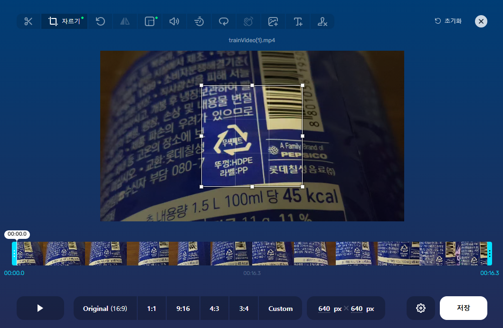

 

**2. DarkLabel**

[https://www.zaivhub.com/ko/yolov5](https://www.zaivhub.com/ko/yolov5)

해당 사이트를 통하여 DarkLabel 프로그램과 data.yaml 파일을 다운 받은 후에 사용하여 수집한 영상 및 이미지에 대해 라벨이 달린 이미지로 변환이 가능합니다.

 

**3. 우선 darklabel.yml 파일을 메모장으로 열어줍니다.**

 

**4. 클래스 plastic_classes를 추가해줍니다.**

 

**5. 제일 하단에 format9를 추가해줍니다.**

 

**6. DarkLabel.exe 실행시키면 9. plastic이 생성됩니다.**

 

**7. 우선, Open Video 버튼을 눌러서 영상을 열고 프레임 별로 이미지 저장을 위해 하단의 체크를 풀고 as Images 버튼을 통해 저장해줍니다.**

 

**8. 그리고 수집한 영상 및 이미지를 DarkLabel 에서 image와 label로 추출합니다.**

 

**9. 위와 같이 해서 얻은 라벨과 이미지의 이름을 변경해줍니다.**

이름 순서로 정렬합니다.

제일 상단을 클릭 후 ctrl + A를 눌러줍니다.

F2 버튼을 눌러줍니다.

파일명을 train1_(1) 로 변경해주시면 다른 파일도 순서에 맞춰서 전부 변경됩니다.

이와 같은 작업을 다른 train 영상들로부터 얻은 모든 image와 label에 적용합니다.

**※ 각각의 이미지에 해당하는 image 파일과 label 파일의 파일명이 동일해야 합니다.**

 

## Data.yaml 파일 수정 및 데이터 모델 다운

**1. yolov5-master 폴더에 Darklabels를 다운받을 때 얻은 data.yml파일을 수정해줍니다.**

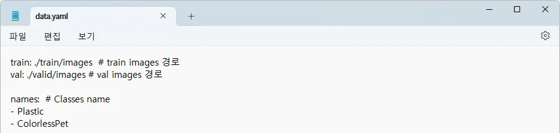

**2. 아래 링크를 통해 yolov5n.pt 파일을 다운받습니다.**

[https://github.com/ultralytics/yolov5/releases/download/v7.0/yolov5n.pt](https://github.com/ultralytics/yolov5/releases/download/v7.0/yolov5n.pt)

**3. 위의 과정들을 통해 얻은 결과물**

해당 결과물은 아래에서 따로 경로를 옮겨줄 예정입니다.

## Google Colaboratory 를 사용하여 코드를 작성해줍니다.

**1. 구글 드라이브와 연동합니다.**

**2. yolov5를 설치합니다.**

**3. train 폴더와 valid 폴더를 생성합니다.**

**4. 위에서 얻었던 결과물을 경로에 맞게 파일을 옮겨줍니다.**

images 폴더와 labels 폴더 위치

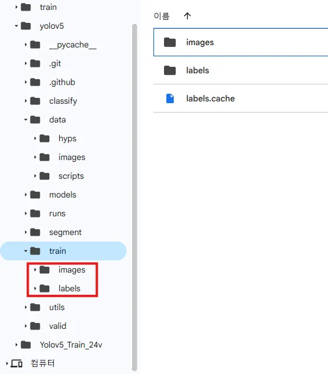

data.yaml 파일 위치

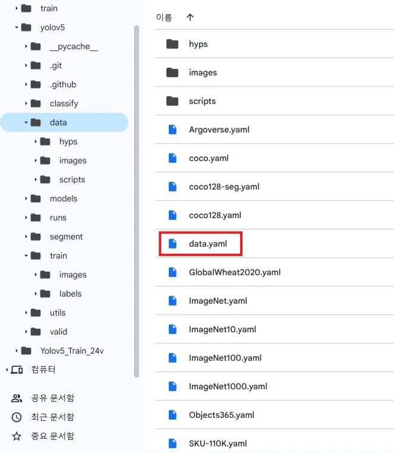

yolov5n.pt 모델 위치

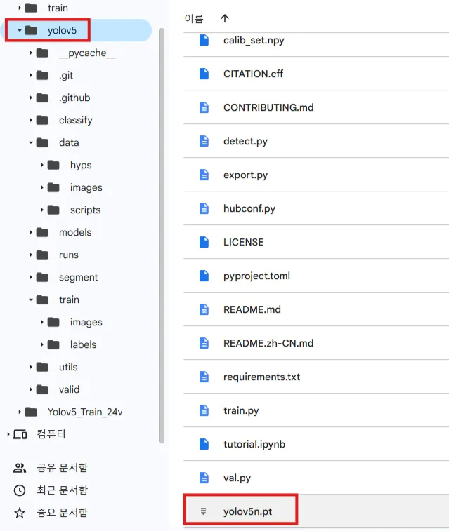

**5. 검증 데이터를 생성합니다.**

python [train.py](http://train.py/) --img 640 --batch 16 --epochs 300 --data .\data\data.yaml --weights [yolov5s.pt](http://yolov5s.pt/)

 

## 학습 시작

**1.  학습을 시작하기 전 사전 준비를 합니다.**

**2. 아래 명령어 실행 시 학습을 시작합니다.**

 

## 학습 결과물 확인

**1. best.pt모델이 생긴 것을 확인 가능합니다.**

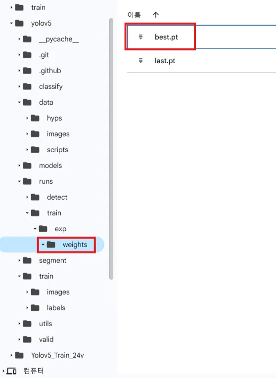

**2. 학습 돌린 결과물 train_batch 확인**

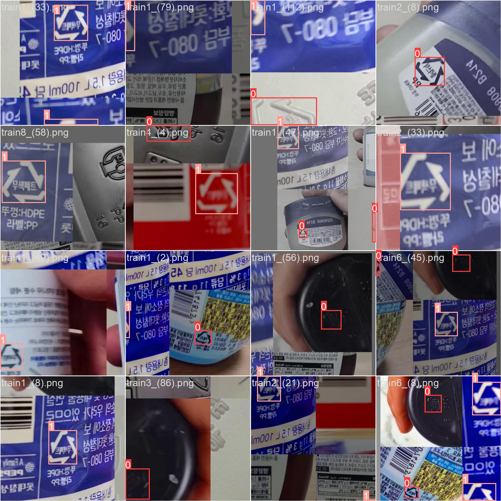

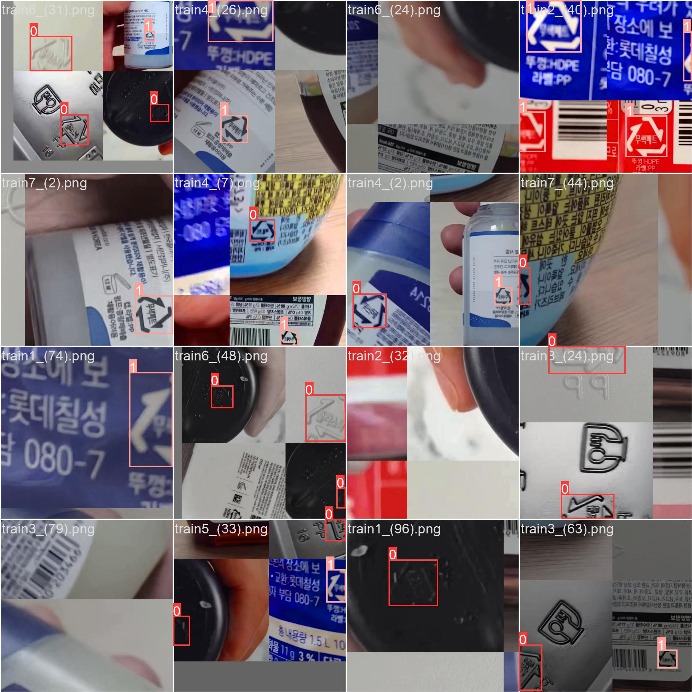

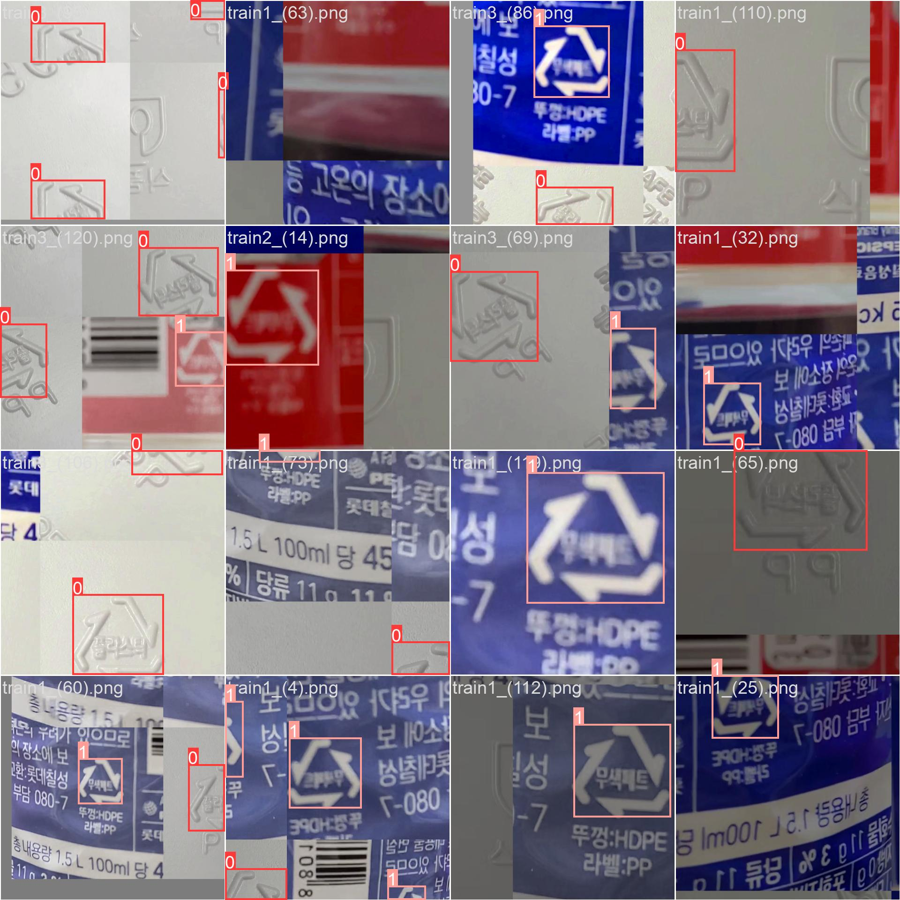

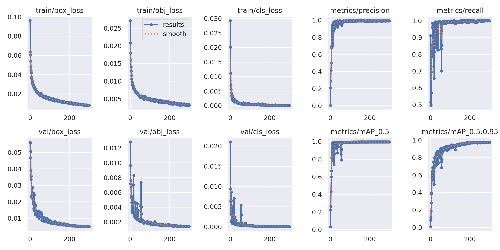

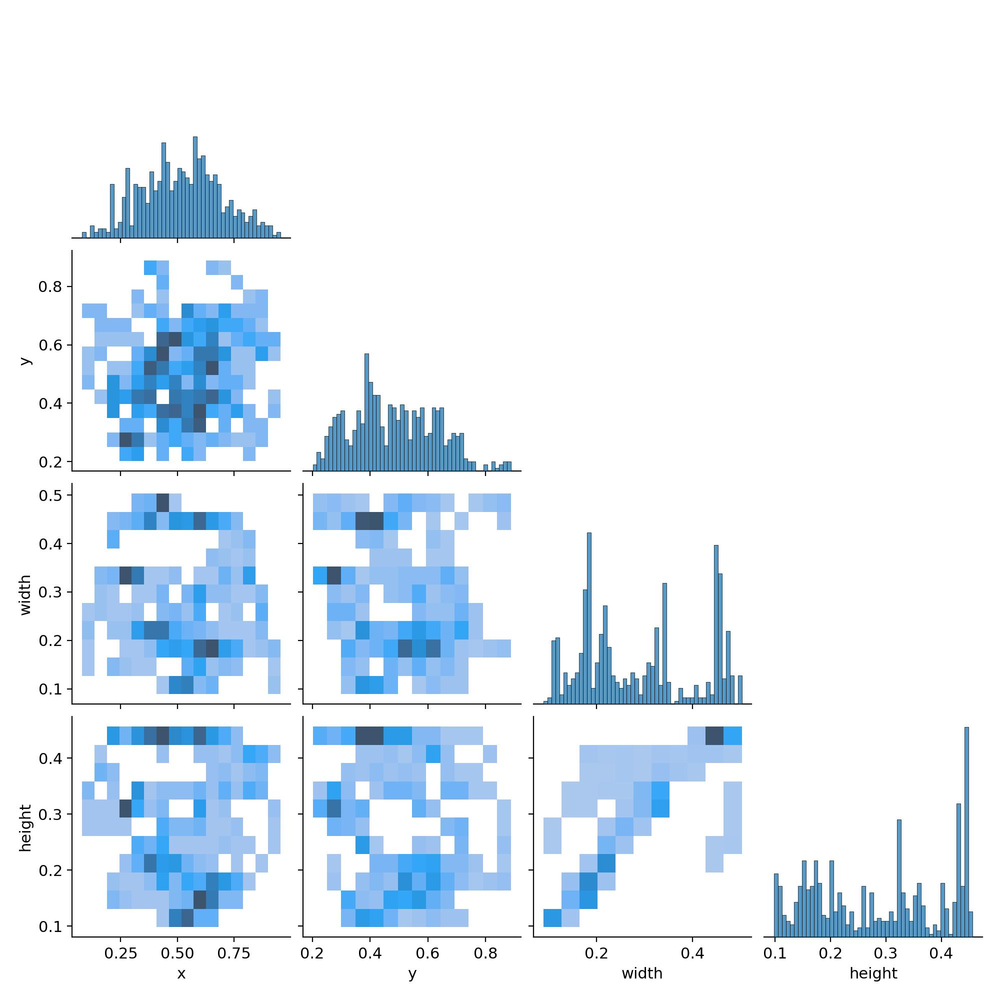

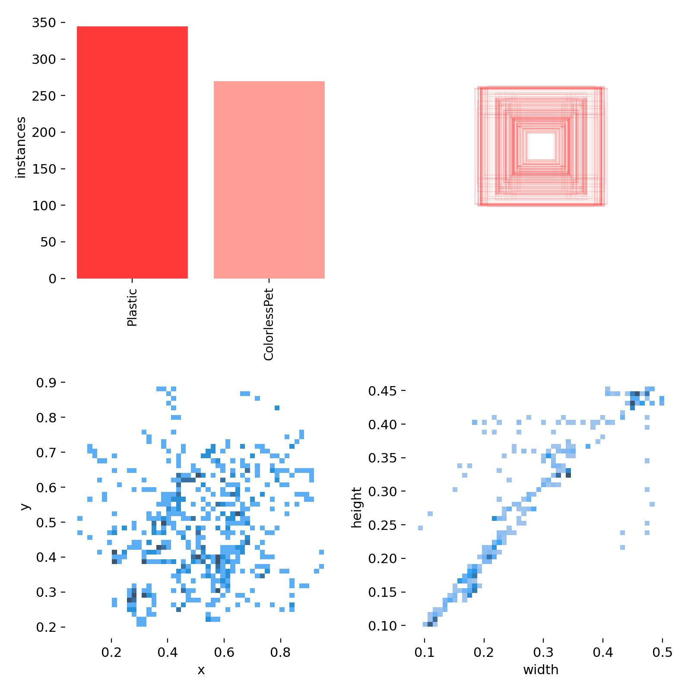

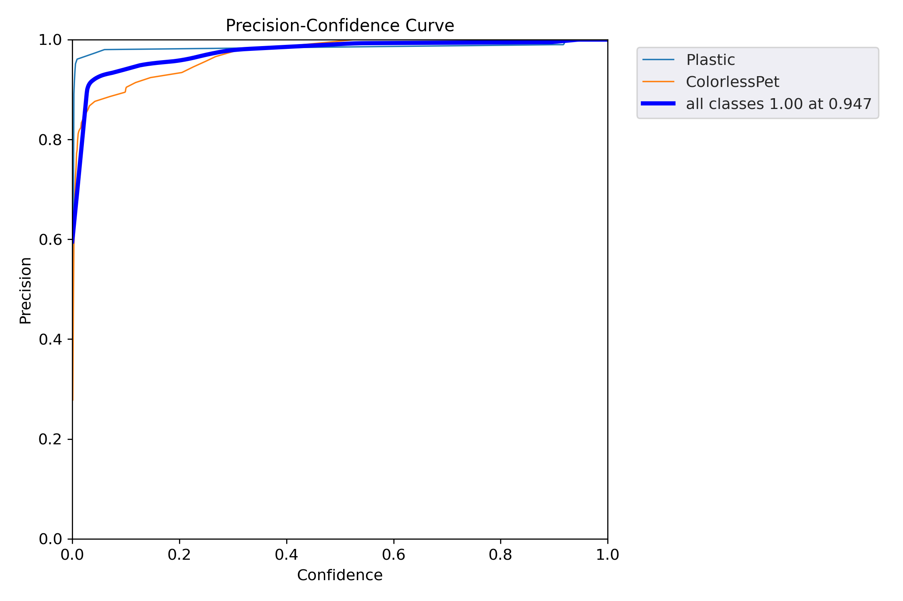

 

## 학습 결과물 검증

**1. 아래의 명령어를 통해 검증을 할 수 있습니다.**

python [detect.py](http://detect.py/) --weight runs/train/exp/weights/best.pt --source [테스트할 이미지의 경로] --img 640 --conf 0.8

**2. 검증 결과**

**3. 또는 아래 명령어로 이미지 대신 영상으로 테스트할 수 있습니다.**

python [detect.py](http://detect.py/) --weight runs/train/exp/weights/best.pt --source [테스트할 영상의 경로] --img 640 --conf 0.8

[test영상으로 나온 detect영상](https://drive.google.com/drive/folders/10aHjcGPqCY0Am8rhcIJPTdkirmEg8USJ?usp=sharing)

test영상으로 나온 detect영상

testVideo(1)은 캔을 제외한 데이터셋을 학습시켜 플라스틱만 인식시킨 테스트 영상입니다.

testVideo(2)는 캔을 포함한 데이터셋을 학습시켜 플라스틱만 인식시킨 테스트 영상입니다. 추후, 따로 캔에 대한 데이터셋을 학습시켜 최신화 시켰습니다.
